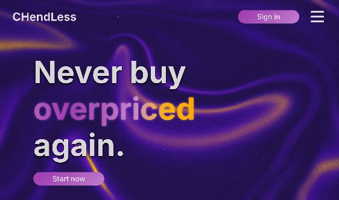
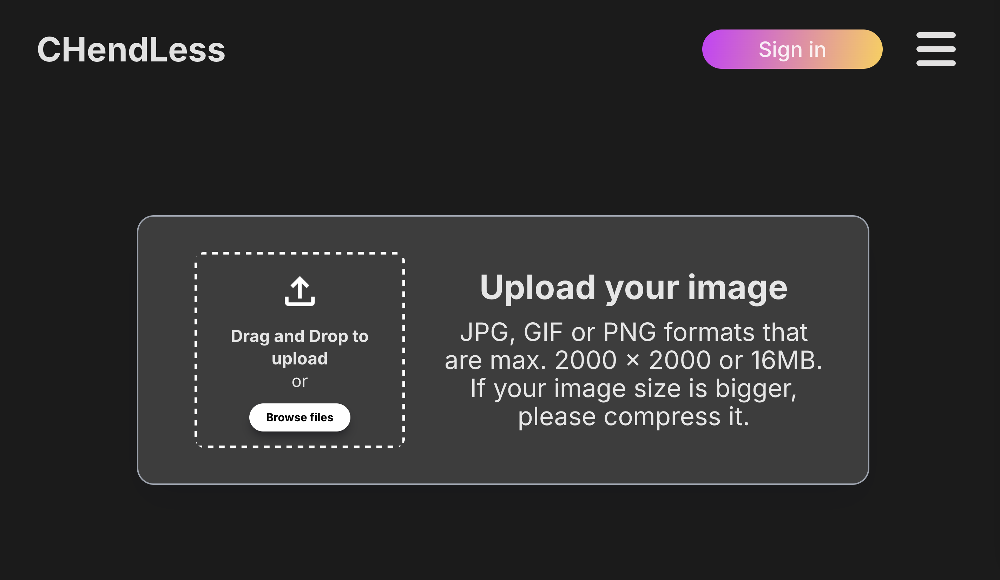
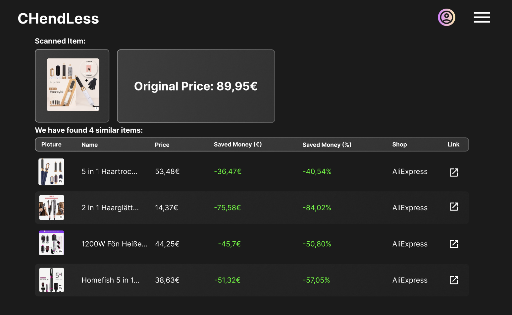

<!-- PROJECT LOGO -->
 

  

<h3 align="center">CHendLess - Buy More, Pay Less</h3>

  

    CHendLess is an innovative web application that makes it easy to find affordable alternatives for any product you desire. By utilizing image processing algorithms based on ImageNet and ResNet, CHendLess analyzes product images and identifies similar offerings across various marketplaces. The result is an interactive and intuitive front end that helps you save money with every purchase.
  

<!-- ABOUT THE PROJECT -->
## CHendLess

CHendLess helps you quickly discover cost-effective alternatives to your desired product. Simply upload an image of the product you're interested in, and our system will search for similar items, ensuring you always get the best price available. The core technology relies on calculating feature distances using pre-trained networks like ImageNet and ResNet, guaranteeing that the recommended products are not only visually similar but also functionally comparable.

1. Upload Image

2. Receive Comparable products

(<a href="#readme-top">back to top</a>)

### Built With

* [![Vue][Vue]][Vue-url]
* [![MongoDB][MongoDB]][MongoDB-url]
* [![Tailwind][Tailwind]][Tailwind-url]
* [![Python][Python]][Python-url]

(<a href="#readme-top">back to top</a>)

<!-- Links -->
<!-- https://www.markdownguide.org/basic-syntax/#reference-style-links -->

[linkedin-shield]: https://img.shields.io/badge/-LinkedIn-black.svg?style=for-the-badge&logo=linkedin&colorB=555
[linkedin-url]: https://www.linkedin.com/in/dennis-schielke-60b82525a/
[Vue-url]: https://vuejs.org/
[Vue]: https://img.shields.io/badge/Vue.js-35495E?style=for-the-badge&logo=vuedotjs&logoColor=4FC08D
[Tailwind-url]: https://tailwindcss.com/
[Tailwind]: https://img.shields.io/badge/Tailwind_CSS-grey?style=for-the-badge&logo=tailwind-css&logoColor=38B2AC
[MongoDB-url]: https://www.mongodb.com/de-de
[MongoDB]: https://img.shields.io/badge/-MongoDB-13aa52?style=for-the-badge&logo=mongodb&logoColor=white
[Python-url]: https://www.python.org/
[Python]: https://img.shields.io/badge/python-3670A0?style=for-the-badge&logo=python&logoColor=ffdd54
